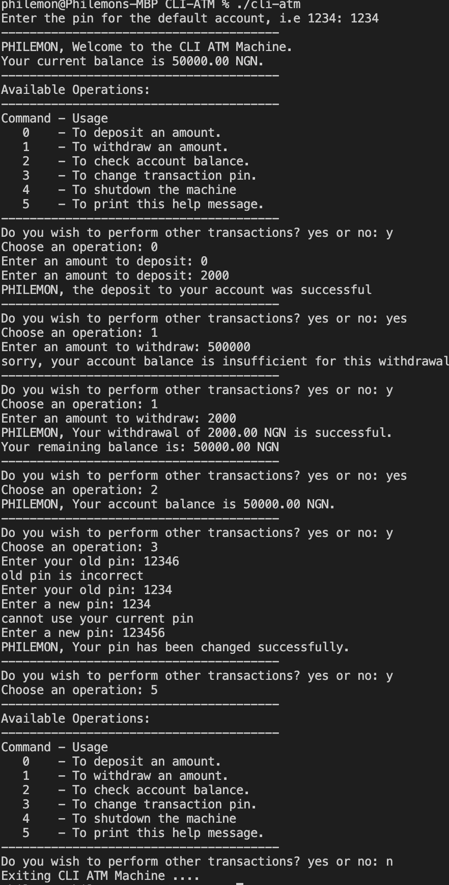

# cli-atm
ATM is a simple ATM machine cli program for the Alt_School third assignment that has the following features:

	- Create an account.
	- Change Pin.
	- Check account balance.
	- Withdraw funds.
	- Deposit funds.
	- Cancel/exit/logout (selecting any of the option will exit the program).

To run you must have go installed and clone this repository on your terminal using `git clone https://github.com/ukane-philemon/cli-atm.git` then:
- `cd cli-atm`
- Run `go build` then `./cli-atm` or run `go install` then `cli-atm`

</img>
